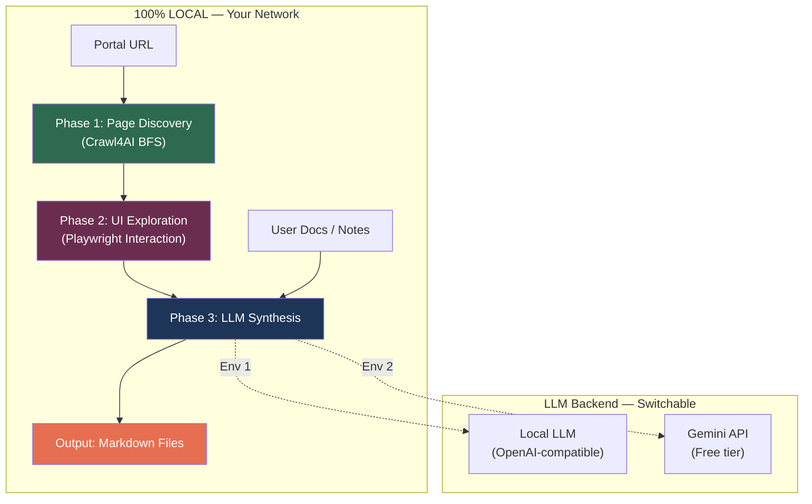

# Portal Context Generator — Implementation Plan (v3.2)

## Goal

Build a **free, self-hosted Python utility** that generates comprehensive **portal context documentation** from any internal portal URL. The output serves as **knowledge input for the bot's action module**, telling it what a portal does, how it works, and what steps to take for any operation.

The tool must handle **dynamic portal UIs** — where clicking a dropdown reveals new elements, selecting a tab changes the visible form, etc. — not just static pages.

---

## Self-Contained Architecture



**No data leaves your network** when using the local LLM. When using Gemini, only UI structure metadata (button labels, form field names, menu text) is sent — never portal data.

---

## The "Portals Are Not Websites" Problem

> [!CAUTION]
> Regular crawlers only see the initial page load. But in portals:
> - Clicking a dropdown reveals new form fields
> - Selecting a tab shows different content
> - Toggling a radio button shows/hides sections
> - Expanding an accordion reveals nested options
> - Modals pop up on button click
>
> **We need to explore these dynamic states to capture the full portal context.**

### Solution: Three-Phase Pipeline

| Phase | What It Does | Tool |
|-------|-------------|------|
| **Phase 1: Discover** | Find all pages/routes in the portal via BFS crawl | Crawl4AI deep crawl |
| **Phase 2: Explore** | On each page, interact with dynamic elements (dropdowns, tabs, etc.) and capture all UI states | Crawl4AI sessions + JS execution + Playwright |
| **Phase 3: Synthesize** | LLM analyzes all page states and generates context documentation | Gemini / Local LLM |

### Phase 2 Detail: Dynamic UI Explorer

For each discovered page, the explorer will:

```
1. Load page → capture initial DOM state + screenshot
2. Find all interactive elements:
   - <select> dropdowns
   - Clickable tabs / tab-like elements  
   - Accordion / expandable sections
   - Radio buttons / checkboxes that toggle UI
   - Buttons that open modals (not submit/navigation buttons)
3. For each interactive element:
   a. Record element label/text and type
   b. Interact with it (click, select option, expand)
   c. Wait for DOM to settle
   d. Capture the resulting DOM diff (what appeared/disappeared)
   e. Take screenshot of new state
   f. Reset to initial state (reload or undo)
4. Output: PageExploration object with all states
```

This uses Crawl4AI's **session management** + **js_code execution** capabilities:
- `session_id` keeps the browser alive across interactions
- `js_code` executes clicks/selections
- `js_only=True` re-captures DOM without re-navigating
- `screenshot=True` captures visual state
- `wait_for` ensures dynamic content has loaded

> [!NOTE]
> **Smart interaction limits**: To avoid combinatorial explosion, we limit to:
> - Max 1 level of interaction depth (click element → capture state, but don't interact with revealed elements)
> - Skip elements that trigger navigation (we already discovered those in Phase 1)
> - Max 20 interactive elements per page
> - Timeout per interaction: 5 seconds

---

## Output Format

### Folder Structure
```
output/
└── portal-name/
    ├── portal_overview.md      # Simple, human-readable: what the portal is & does
    ├── portal_manifest.md      # Machine-readable page index + capabilities
    ├── pages/                  # Detailed per-page UI analysis
    │   ├── dashboard.md
    │   ├── content_library.md
    │   ├── create_stream.md
    │   └── ...
    ├── processes/              # Task → Process → Steps mappings
    │   ├── curate_vod_stream.md
    │   ├── manage_users.md
    │   └── ...
    ├── portal_context.md       # Consolidated single-file (everything)
    └── screenshots/            # Page screenshots (various states)
        ├── dashboard_initial.png
        ├── create_stream_initial.png
        ├── create_stream_category_dropdown.png
        └── ...
```

### Output File 1: `portal_overview.md` (Human-Readable)

A simple, plain-English explanation of the portal — no step-by-step detail, just understanding.

```markdown
# Portal: VOD Management Portal

> **URL**: https://vod-portal.internal.com  
> **Generated**: 2026-05-07  

## What This Portal Is
The VOD Management Portal is an internal tool used by the content operations 
team to manage Video-on-Demand streams across the platform.

## What It Does
- **Stream Management**: Create, edit, and delete VOD streams
- **Content Curation**: Organize streams into categories and collections
- **Publishing Workflow**: Submit streams for review and publish to production
- **Analytics Dashboard**: View stream performance metrics and viewer data

## Key Entities
- **Stream**: A single VOD content item with title, category, metadata
- **Collection**: A group of related streams curated together
- **Category**: Classification taxonomy for streams (e.g., Sports, News, Entertainment)

## Portal Sections
| Section | Purpose |
|---------|---------|
| Dashboard | Overview of recent activity and key metrics |
| Content Library | Browse and search all existing streams |
| Create/Edit Stream | Form-based stream creation and editing |
| Collections | Manage curated stream collections |
| Settings | Portal configuration and user preferences |

## Internal Terminology
| Term | Meaning |
|------|---------|
| VOD | Video on Demand |
| CMS | Content Management System |
| EPG | (kept as-is — internal abbreviation) |
| QC | (kept as-is — internal abbreviation) |
```

> [!IMPORTANT]
> **Abbreviation Rule**: Internal abbreviations are preserved as-is. Only expand an abbreviation if the portal itself provides the expansion (e.g., in a tooltip, help text, or glossary). Never guess.

### Output File 2: Detailed Pages (`pages/*.md`)

```markdown
# Page: Create New Stream

- **URL**: /content/streams/create
- **Purpose**: Create a new VOD stream entry
- **Parent Navigation**: Sidebar → Content Management → Streams → "Create New" button

## Initial State

### Form: Stream Details
| Field | Type | Required | Notes |
|-------|------|----------|-------|
| Title | text input | Yes | - |
| Description | textarea | No | Rich text editor |
| Category | dropdown | Yes | See dynamic states below |
| Tags | multi-select | No | Type-ahead search |
| Publish Date | date picker | No | Defaults to today |

### Actions
| Element | Type | Action |
|---------|------|--------|
| "Save Draft" | button (secondary) | Saves without publishing |
| "Submit for Review" | button (primary) | Submits to approval workflow |
| "Cancel" | link | Returns to stream listing |

## Dynamic States

### State: Category Dropdown Expanded
- **Trigger**: Click "Category" dropdown
- **Revealed Elements**:
  - Option: "Sports"
  - Option: "News"  
  - Option: "Entertainment"
  - Option: "Documentary"
- **Side Effect**: Selecting "Sports" reveals additional field "Sport Type" (dropdown)

### State: "Sport Type" Sub-Dropdown (after selecting Category = "Sports")
- **Trigger**: Select "Sports" from Category
- **Revealed Elements**:
  - Field: "Sport Type" (dropdown) — Options: Cricket, Football, Tennis, Other
  - Field: "League/Tournament" (text input)
- **Hidden Elements**: None
```

### Output File 3: Process Documentation (`processes/*.md`)

```markdown
# Process: Curate a VOD Stream

> **Task**: Create and publish a new VOD stream
> **Portal**: VOD Management Portal
> **Steps**: 6

## Steps

### Step 1: Navigate to Stream Creation
- **Action**: Click "Content Management" in sidebar → Click "Streams" → Click "Create New"
- **URL**: /content/streams/create
- **Result**: Stream creation form loads

### Step 2: Fill Stream Details
- **Action**: Complete the form fields
- **Fields**:
  - Title (required)
  - Category (required, select from dropdown)
  - Description (optional)
  - Tags (optional)

### Step 3: Handle Conditional Fields
- **Condition**: If Category = "Sports"
- **Action**: Additional fields appear — fill "Sport Type" and "League/Tournament"

### Step 4: Submit for Review
- **Action**: Click "Submit for Review" button
- **Result**: Success notification, redirected to stream listing

## Alternative Flows
- **Save as Draft**: At Step 4, click "Save Draft" instead
- **Cancel**: Click "Cancel" at any point
```

---

## Tool Stack (All Free & Open-Source)

| Component | Tool | License | Why |
|-----------|------|---------|-----|
| **Crawling + Interaction** | Crawl4AI | Apache 2.0 | BFS deep crawl, JS execution, sessions, screenshots, Playwright-backed |
| **HTML Parsing** | BeautifulSoup4 | MIT | Extract interactive elements from DOM |
| **LLM (Option 1)** | Gemini via `google-genai` | Free API tier | For environments with Google access |
| **LLM (Option 2)** | Local LLM via `httpx` | MIT | Direct HTTP calls to your OpenAI-compatible endpoint. No third-party SDK needed. |
| **UI** | Streamlit | Apache 2.0 | Interactive portal context builder |
| **Doc Parsing** | PyPDF2 / python-docx / python-pptx | Various OSS | Supplementary document processing |

> [!NOTE]
> **About LLM Option 2**: Your local LLM server exposes an OpenAI-compatible REST API (`POST /v1/chat/completions`). We call it with plain `httpx` (a simple HTTP client) — no `openai` SDK needed. The request is just a JSON POST to your server. Nothing touches OpenAI. We chose `httpx` over the `openai` SDK to keep the dependency minimal and avoid any confusion.

---

## Environment Setup (Mandatory)

> [!IMPORTANT]
> **Always use a Python virtual environment (venv).** This is mandatory for all environments.

```bash
# 1. Create virtual environment (one-time)
python -m venv venv

# 2. Activate it (Windows PowerShell)
.\venv\Scripts\Activate.ps1

# 3. Activate it (Windows CMD)
.\venv\Scripts\activate.bat

# 4. Activate it (Linux/Mac)
source venv/bin/activate

# 5. Install dependencies
pip install -r requirements.txt

# 6. Install Playwright browsers (required by Crawl4AI)
playwright install chromium
```

All CLI commands in this document assume the venv is activated.

---

## Implementation Detail

### Component 1: Core Library (`portal_context/`)

#### [NEW] `portal_context/config.py`
```python
@dataclass
class PortalConfig:
    portal_url: str
    portal_name: str                    # Auto-derived from URL if not given
    llm_provider: Literal["gemini", "openai"]
    llm_model: str                      # e.g. "gemini-2.0-flash" or "your-model"
    llm_api_key: str
    llm_base_url: str = ""              # Only for openai-compatible provider
    max_depth: int = 3                  # BFS crawl depth
    max_pages: int = 100                # Max pages to discover
    max_interactions_per_page: int = 20  # Dynamic UI exploration limit
    interaction_timeout: int = 5         # Seconds to wait per interaction
    capture_screenshots: bool = True
    output_dir: str = "./output"
    
    # Authentication
    auth_method: Literal["none", "profile", "cdp"] = "none"
    chrome_profile_dir: str = ""        # Path to Chrome profile (for "profile" method)
    cdp_url: str = ""                   # e.g. "http://localhost:9222" (for "cdp" method)
```

---

#### [NEW] `portal_context/llm_provider.py`
Unified interface for both LLM backends:

```python
class LLMProvider(ABC):
    @abstractmethod
    async def generate(self, prompt: str, system_prompt: str = "") -> str: ...
    @abstractmethod
    async def generate_with_image(self, prompt: str, image_path: str) -> str: ...

class GeminiProvider(LLMProvider):
    # Uses google-genai SDK, supports multimodal (text + screenshots)
    # Free tier: gemini-2.0-flash (15 RPM, 1M TPM)
    
class OpenAICompatibleProvider(LLMProvider):
    # Plain httpx POST to your local LLM's /v1/chat/completions endpoint
    # No openai SDK — just a simple HTTP call
    # Example: POST http://your-llm:8080/v1/chat/completions
    #          Body: {"model": "...", "messages": [...]}

class CustomAPIProvider(LLMProvider):
    # For LLMs with non-standard APIs (simple POST with input/output fields)
    # See docs/llm_integration_guide.md for details
    # Configurable request/response field mapping
```

---

#### [NEW] `portal_context/crawler.py` — Phase 1: Page Discovery

- Crawl4AI `AsyncWebCrawler` with `BFSDeepCrawlStrategy`
- `include_external=False` — stays within portal domain
- For each page captures: URL, title, raw HTML, clean markdown, screenshot
- Returns `list[DiscoveredPage]`

---

#### [NEW] `portal_context/ui_explorer.py` — Phase 2: Dynamic UI Exploration

**This is the critical new component** that handles the "portals are not websites" problem.

```python
class UIExplorer:
    """Explores dynamic UI states on each portal page."""
    
    async def explore_page(self, page_url: str, session_id: str) -> PageExploration:
        """
        1. Load page, capture initial state
        2. Find interactive elements via JS:
           - All <select> elements
           - Elements with role="tab" or tab-like behavior
           - Accordion triggers (.accordion, [data-toggle="collapse"], etc.)
           - Radio/checkbox groups that toggle visibility
           - Buttons with aria-haspopup, aria-expanded, etc.
        3. For each element:
           - Click/interact via js_code
           - Wait for DOM to settle (wait_for + timeout)
           - Capture resulting state (HTML + screenshot)
           - Compute DOM diff (what elements appeared/disappeared)
           - Reset page state
        4. Return PageExploration with all states
        """
```

Uses Crawl4AI's session + JS capabilities:
```python
# Initial state capture
config = CrawlerRunConfig(
    session_id=f"explore_{page_id}",
    screenshot=True,
    scan_full_page=True,
)

# Interact with a dropdown
interact_config = CrawlerRunConfig(
    session_id=f"explore_{page_id}",
    js_only=True,  # Don't re-navigate
    js_code="""
        const el = document.querySelector('#category-dropdown');
        if (el) el.click();
    """,
    wait_for="js:() => document.querySelector('.dropdown-menu.show') !== null",
    delay_before_return_html=1.0,
    screenshot=True,
)
```

The JS for finding interactive elements:
```javascript
// Injected via js_code to discover interactive elements
(() => {
    const interactives = [];
    
    // Dropdowns
    document.querySelectorAll('select, [role="listbox"], [data-toggle="dropdown"]')
        .forEach(el => interactives.push({
            type: 'dropdown', 
            selector: uniqueSelector(el),
            label: getLabel(el),
            options: el.tagName === 'SELECT' ? 
                [...el.options].map(o => o.text) : []
        }));
    
    // Tabs
    document.querySelectorAll('[role="tab"], .nav-tab, .tab-item')
        .forEach(el => interactives.push({
            type: 'tab',
            selector: uniqueSelector(el),
            label: el.textContent.trim(),
            active: el.classList.contains('active') || 
                    el.getAttribute('aria-selected') === 'true'
        }));
    
    // Accordions / Expandables
    document.querySelectorAll('[data-toggle="collapse"], .accordion-header, details > summary')
        .forEach(el => interactives.push({
            type: 'accordion',
            selector: uniqueSelector(el),
            label: el.textContent.trim(),
            expanded: el.getAttribute('aria-expanded') === 'true'
        }));
    
    // Buttons that show modals/popups (not navigation)
    document.querySelectorAll('[data-toggle="modal"], [aria-haspopup="dialog"]')
        .forEach(el => interactives.push({
            type: 'modal_trigger',
            selector: uniqueSelector(el),
            label: el.textContent.trim()
        }));
    
    return JSON.stringify(interactives);
})();
```

---

#### [NEW] `portal_context/ui_analyzer.py` — HTML → Structured UI Data

Parses raw HTML (from each page state) into structured data:
- Navigation elements (sidebar, header nav, breadcrumbs)
- Forms with field details (label, type, required, options)
- Action buttons (create, edit, delete, submit, cancel)
- Data tables (column headers only — reveals entity structure)
- Sections and organizational structure

Does **not** extract data values — only UI structure.

---

#### [NEW] `portal_context/synthesizer.py` — Phase 3: LLM Context Generation

Provider-agnostic — works with both Gemini and local LLM.

**Pass 1 — Page Understanding** (per page):
```
Prompt: "Given this page's URL, UI elements, form fields, action buttons, 
and its various dynamic states (when dropdown X is clicked, Y appears), 
describe: What is this page for? What operations can a user perform? 
What entities does it manage? 

RULES:
- Do NOT expand abbreviations unless the page itself shows the expansion
- Preserve all internal terminology exactly as shown
- Focus on OPERATIONS, not data content"
```

**Pass 2 — Portal Overview** (all pages together):
```
Prompt: "Given all page analyses for this portal, write a concise overview:
- What is this portal?
- What does it do?
- What are the key sections?
- What entities does it manage?
- List any internal terminology/abbreviations as-is

Write in simple, clear English. This is a high-level explanation, 
NOT step-by-step instructions."
```

**Pass 3 — Process Discovery** (all pages together):
```
Prompt: "Given all page analyses with their UI elements and dynamic states,
identify the distinct end-to-end processes a user can complete.
For each process, provide:
- Process name
- What task it accomplishes
- Sequential steps (which page, what action, what result)
- Any conditional branches (if X then Y)
- Alternative flows"
```

**Pass 4 — User Context Merge** (if docs/notes provided):
Integrates supplementary documentation into the appropriate sections.

---

#### [NEW] `portal_context/doc_parser.py`
Parses supplementary documents (PDF, DOCX, PPTX, MD, TXT) into text.

#### [NEW] `portal_context/writer.py`
Writes the complete output folder structure with all markdown files.

---

### Component 2: CLI (`cli.py`)

```bash
# Basic — Gemini provider (no auth needed for portal)
python cli.py --url https://portal.internal.com \
  --provider gemini --api-key YOUR_GEMINI_KEY

# With browser profile auth (uses your logged-in Chrome cookies)
python cli.py --url https://portal.internal.com \
  --provider gemini --api-key KEY \
  --auth profile --chrome-profile "C:/Users/you/AppData/Local/Google/Chrome/User Data"

# With CDP connection (connect to already-running Chrome)
python cli.py --url https://portal.internal.com \
  --provider gemini --api-key KEY \
  --auth cdp --cdp-url http://localhost:9222

# Local LLM provider
python cli.py --url https://portal.internal.com \
  --provider openai --llm-url http://llm:8080/v1 --model llama-3

# With supplementary docs and notes
python cli.py --url https://portal.internal.com \
  --provider gemini --api-key KEY \
  --docs ./sop.pdf ./guide.docx \
  --notes "This portal is used by the content ops team for VOD curation"

# Tuning
python cli.py --url https://portal.internal.com \
  --provider gemini --api-key KEY \
  --max-depth 4 --max-pages 200 --max-interactions 30
```

---

### Component 3: Streamlit UI (`app.py`)

1. **Sidebar — Configuration**
   - LLM Provider toggle (Gemini / OpenAI-compatible)
   - API key, model, base URL
   - Crawl settings (depth, max pages, interaction limit)

2. **Main — Generate Context**
   - Portal URL + name
   - File upload for supplementary docs
   - Text area for manual notes
   - "Generate" button with progress stages:
     - `Phase 1: Discovering pages... (12/100 found)`
     - `Phase 2: Exploring UI... (page 3/12, interaction 5/15)`
     - `Phase 3: Generating context... (pass 2/4)`
   - Live preview of generated files
   - Download as ZIP

---

### Component 4: Dependencies

#### [NEW] `requirements.txt`
```
crawl4ai>=0.6.0
google-genai>=1.0.0
httpx>=0.27.0
streamlit>=1.30.0
beautifulsoup4>=4.12.0
PyPDF2>=3.0.0
python-docx>=1.0.0
python-pptx>=0.6.21
pydantic>=2.0.0
python-dotenv>=1.0.0
```

> [!NOTE]
> All dependencies are installed inside the venv. Run `pip install -r requirements.txt` after activating the virtual environment.

#### [NEW] `.env.example`
```env
# LLM Provider: "gemini", "openai", or "custom"
LLM_PROVIDER=gemini

# Gemini (free tier)
GEMINI_API_KEY=your-key
GEMINI_MODEL=gemini-2.0-flash

# OpenAI-compatible local LLM (called via plain HTTP, no openai SDK)
LLM_BASE_URL=http://your-llm:8080/v1
LLM_API_KEY=your-key
LLM_MODEL=your-model

# Custom LLM (simple POST API — see docs/llm_integration_guide.md)
# LLM_BASE_URL=http://your-llm:5000/generate
# LLM_REQUEST_FIELD=input       # Field name for the prompt in request body
# LLM_RESPONSE_FIELD=output     # Field name for the response in response body

# Portal Authentication (optional)
# AUTH_METHOD=profile
# CHROME_PROFILE_DIR=C:/Users/you/AppData/Local/Google/Chrome/User Data
# AUTH_METHOD=cdp
# CDP_URL=http://localhost:9222
```

#### [NEW] `README.md`
Full documentation: setup, usage, output format, configuration reference.

---

## Abbreviation Handling Rules

Built into all LLM prompts as hard rules:

1. **Never expand** abbreviations unless the portal itself shows the full form (in tooltips, help text, labels, or a glossary page)
2. **If an abbreviation is widely universal** (e.g., URL, HTTP, API, PDF) — these can be left as-is too, no need to expand
3. **Collect all abbreviations** found in the portal into a terminology table in `portal_overview.md`
4. **Mark uncertain ones**: If the LLM sees something that *might* be an abbreviation but isn't sure, list it in the terminology table with "(internal term)" rather than guessing an expansion

---

## Portal Authentication Strategy (Resolved)

### The Constraint
Chrome **locks** its profile directory while running. If your portal is already open in a Chrome window, Playwright cannot use that same profile simultaneously.

### Approach 1: Profile Copy (Primary — Recommended)
The tool **automatically copies** your Chrome profile to a temporary directory before launching the crawler. This preserves all cookies, sessions, and SSO tokens.

```
1. Tool reads your Chrome profile dir (you configure the path once)
2. Copies it to a temp location (avoids the lock conflict)
3. Crawl4AI launches with the copied profile → inherits your login session
4. After crawling, temp copy is cleaned up
```

**Config**: `--auth profile --chrome-profile "C:/Users/you/AppData/Local/Google/Chrome/User Data"`

> [!NOTE]
> This works as long as your SSO session/cookies haven't expired. Most enterprise SSO sessions last hours or days, so the copied cookies remain valid for the duration of the crawl.

### Approach 2: CDP Connection (Advanced)
If your environment allows it, you can launch Chrome with the remote debugging flag and the tool connects directly to the running browser — no copy needed.

```bash
# Launch Chrome with debugging enabled (one-time)
chrome.exe --remote-debugging-port=9222

# Then run the tool
python cli.py --url https://portal.internal.com --auth cdp --cdp-url http://localhost:9222
```

Crawl4AI/Playwright can connect to an existing browser via CDP and use its live pages/sessions directly.

**Trade-off**: Requires Chrome to be started with the debugging flag. In your office environment, this might require IT coordination.

### Approach 3: No Auth (Fallback)
For portals that don't require authentication, or for initial testing.

> [!TIP]
> **Recommendation for your environment**: Start with **Profile Copy**. It's the most practical — you just tell the tool where your Chrome profile lives, and it handles the rest. If sessions are too short-lived, we can explore CDP.

---

> [!IMPORTANT]
> **No open blockers remain.** The plan is ready for your approval to begin implementation.

---

## Custom LLM Integration

If your local LLM does **not** follow the OpenAI-compatible API format and instead has a simple custom API, the tool supports it natively via the `custom` provider.

A detailed guide with step-by-step instructions, code examples, and an adapter pattern is available at:

📄 **[LLM Integration Guide](file:///e:/2026/May/Portal-Context/docs/llm_integration_guide.md)**

**Quick summary**: If your LLM has a simple `POST /generate` endpoint with `{"input": "..."}` → `{"output": "..."}`, you can use it directly by setting:
```env
LLM_PROVIDER=custom
LLM_BASE_URL=http://your-llm:5000/generate
LLM_REQUEST_FIELD=input
LLM_RESPONSE_FIELD=output
```

If your API is more complex or needs transformation, see the guide for the **adapter wrapper** approach.

---

## Verification Plan

### Automated Tests
- Unit tests for `ui_analyzer.py` with sample HTML fixtures (forms, dropdowns, tabs)
- Unit tests for `doc_parser.py` with sample PDF/DOCX files
- Integration test: crawl + explore a public website with dynamic elements
- Output structure validation against expected folder layout

### Manual Verification
- Run against one of your internal portals (you'll need to test authentication)
- Review generated `portal_overview.md` for accuracy
- Review process documentation for step correctness
- Test both Gemini and local LLM providers
- Verify dynamic UI states are captured (dropdown options, tab contents)
- Confirm abbreviations are preserved correctly
